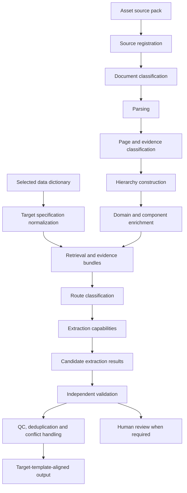

# SEGRO Evidence-First Architecture

## System Context

The engine accepts a selected SEGRO data dictionary, an arbitrary supported asset source pack, and asset/customer configuration. It must work for new assets without prior extraction results and without assuming Enfield-specific file names, manual parts or fixed page numbers.



Canonical stage sequence:

```text
Source registration
-> document classification
-> parsing
-> page/evidence classification
-> hierarchy construction
-> domain/component enrichment
-> retrieval and evidence bundles
-> route classification
-> extraction
-> independent validation
```

## Module Boundaries

- `config`: safe local/environment settings. API keys remain environment-only.
- `models`: target, source, index, bundle and candidate schemas.
- `interfaces`: provider-neutral extraction capability protocols.
- `services`: small reusable foundation utilities such as hashing.
- `validation`: independent validation result contracts.
- `telemetry`: provider-neutral run metrics and cost accounting contracts.
- `cli`: command skeleton and future public entry point.

## Retrieval and Extraction

Retrieval and extraction are separate. Retrieval selects documents, sections, pages, sheets, text blocks, tables, drawings and image regions. Extraction capabilities receive bounded evidence bundles and produce candidates only. They do not decide final acceptance.

## Hierarchical Indexing

The foundation adopts an independent PageIndex-style hierarchy, not the external PageIndex
package. The hierarchy supports:

```text
Source pack
  Document
    Section
      Subsection
        Page or sheet
          Text blocks
          Tables
          Drawings
          Image regions
```

Index nodes use provider-neutral references for searchable text, semantic representations and regions. No embedding or vector database dependency is required in the foundation.

### PageIndex Suitability Assessment

Flat chunk retrieval alone is insufficient for SEGRO source packs because it loses manual, section,
subsection, page/sheet and evidence-unit context. A field such as a pump duty, certificate date or
manufacturer can appear many times in repeated supplier appendices; a flat result list cannot reliably
show whether the hit came from the right document, component, page, table, drawing or certificate.

A PageIndex-style hierarchy is suitable for long technical manuals exceeding 2,000 pages and mixed
source packs because it gives navigation boundaries above individual chunks. It supports document ->
section -> subsection -> page/sheet -> evidence-unit traversal while still allowing page-level and
evidence-unit retrieval. Where bookmarks and tables of contents exist, they should seed candidate
sections and page spans. Where explicit structure is absent, hierarchy can be inferred from headings,
layout signals, page labels, repeated headers/footers, table captions, drawing titles and file-level
classification.

The approach must handle scans, drawings, tables, repeated supplier content and weak headings by
allowing low-confidence or warning-bearing nodes. Pages and evidence units can be indexed even when
section boundaries are uncertain. Drawing, table and image-region nodes should preserve region
references rather than forcing all evidence into text chunks.

Risks are explicit. Hierarchy generation has cost in parsing, OCR/layout analysis and optional model
classification. Incorrect section boundaries can propagate into retrieval and bundle construction, so
retrieval must be able to fall back to neighboring pages, page-only evidence and flat candidates.
Hierarchy construction telemetry must record document counts, page/sheet counts, bookmark/TOC use,
inferred-node counts, low-confidence boundaries, OCR-required pages, table/drawing counts, warnings,
duration and rebuild decisions.

Incremental rebuilding should use source hashes. Unchanged source files can retain persisted index
nodes and derived references, while changed files invalidate only the affected document subtree and
dependent retrieval caches. Persistence must be provider-neutral: local JSON/Parquet/SQLite or another
store may hold node metadata and references, but the contracts must not require a vector database,
embedding provider or model provider.

Recommendation: implement an independent PageIndex-style hierarchy, adapting selected concepts from
the historical implementation. Do not add the external PageIndex package as a dependency in the
foundation. A later sprint must compare hierarchical retrieval against a flat-retrieval baseline using
synthetic and Enfield evaluation sets before treating the hierarchy as operationally proven.

See [ADR-002](decisions/ADR-002-hierarchical-evidence-index.md).

## Classifier Contracts

Classification is first-class and remains separate from extracted asset facts, extraction candidates
and validation decisions. A classifier result records classifier identity, version, stage, subject,
labels, confidence, alternative labels, evidence references, rationale, method, optional model/prompt
metadata, warnings, human override and timestamp.

The distinct classifier stages are:

- source/document classification;
- page/evidence-type classification;
- domain/component classification;
- extraction-route classification.

These results are serializable and suitable for a future customer evidence pack. They may inform
retrieval, routing and review, but they do not by themselves assert extracted facts or promote values.

## Bounded Evidence Bundles

Evidence bundles carry the target specification, selected document/section/page IDs, text evidence, table references, visual references, retrieval scores, reasons, provenance and warnings. The same bundle shape can be consumed by deterministic, table, text LLM, VLM, OCR, validation and human-review modules.

## Capability Routing

Future capabilities declare supported evidence types, field semantics, input requirements, output schema, confidence approach, rejection rules and validation requirements. The foundation defines the protocol but does not implement extraction.

## Independent Validation

Candidate values are not promoted because an extractor returned them. Validation separately records evidence grounding, component identity, field semantics, data type, unit, cardinality, reference-list, conflict and duplicate findings.

## Telemetry

Telemetry tracks stage timings, document/page counts, retrieval operations, candidates, model calls, token usage, estimated cost, accepted/rejected values, warnings and failures. Pricing remains configuration-backed, not business-logic hard-coded.

## Local-First Operation

Foundation tests make no hosted-model calls and require no API key. Hosted LLM/VLM use is represented only by configuration flags and future interfaces.

## Prior Results

Prior-result reuse may become an evaluation or review-assist feature outside the clean extraction core. It must not be a dependency of target normalization, retrieval, extraction or validation.

## Extension Points

Planned extension modules include dictionary ingestion, source ingestion, document classification, indexing, retrieval, reranking, bundle construction, extraction capability implementations, validation, QC/conflict handling and output alignment.

## Foundation Sprint Non-Goals

- no real extraction
- no Enfield rules
- no fixed manual Part 1-6 orchestration
- no fixed page mappings
- no hosted-model calls
- no OCR, embedding, vector database or parser stack installation
- no target-template export
